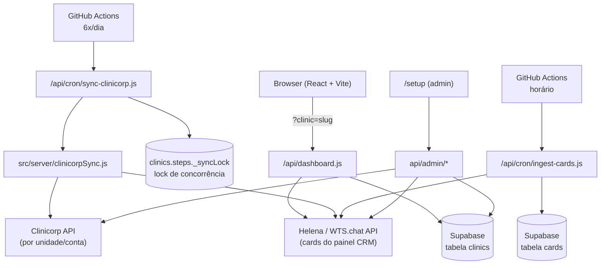

# Dashboard Odontológico — Multi-Clínica

> Dashboard de performance para clínicas odontológicas, integrado ao CRM Helena
> (WTS.chat) e, opcionalmente, sincronizado automaticamente com o Clinicorp.
> Multi-clínica sem redeploy — cada clínica acessa seu próprio dashboard por
> slug, com configuração isolada no banco.

---

## Visão geral

```
https://seu-dominio.vercel.app/?clinic=slug-da-clinica
```

Cada clínica é uma linha na tabela `clinics` (Supabase): token do painel
Helena, mapeamento de etapas do funil e, se aplicável, credenciais das contas
Clinicorp vinculadas. Tudo isso fica no banco — nunca no frontend nem no
código do repositório.

O dashboard não guarda os cards em cache: cada carregamento busca direto do
painel Helena, monta as métricas e devolve um payload compacto ao React.
Quando a clínica tem Clinicorp vinculado, um motor de sincronização separado
mantém o painel Helena atualizado automaticamente com o que acontece no
Clinicorp (agendamentos, faltas, orçamentos aprovados).

---

## Conceito central: 3 datas independentes por paciente

Todo paciente que passa pelo funil pode ter até três datas, guardadas em
campos separados que nunca se sobrescrevem:

| Data | O que representa |
|---|---|
| **Agendado em** | Quando a consulta foi marcada |
| **Agendado Para** | A data da consulta em si — imutável depois de marcada |
| **Fechado em** | Quando o orçamento foi aprovado — pode ser muito depois da consulta |

Cada métrica do dashboard (funil, tabelas por dimensão, receita) escolhe qual
dessas datas usar dependendo do que está medindo. Essa distinção é o que
permite, por exemplo, que um orçamento aprovado meses após a consulta conte
como receita do mês certo, sem "puxar" o card antigo para o período errado.
As regras completas de cálculo (qual data cada métrica usa, como as etiquetas
de origem/agendador são resolvidas, etc.) vivem em documentação interna, fora
deste repositório.

---

## Arquitetura



### Componentes principais

- **`api/dashboard.js`** — serverless function que resolve a clínica (por
  `accountId` ou slug), pagina os cards do painel Helena, aplica as regras de
  extração/dimensões/funil configuradas para aquela clínica e devolve o JSON
  que o React consome.
- **`src/server/clinicorpSync.js`** — motor de sincronização Clinicorp → Helena.
  Uma clínica pode ter mais de uma **unidade** (conta Clinicorp separada — ex:
  duas filiais físicas), cada uma casada com uma etiqueta própria no painel,
  para nunca misturar dados entre contas. Roda de forma incremental: a partir
  da segunda execução, busca só o que mudou desde a última rodada bem-sucedida.
- **`api/cron/sync-clinicorp.js`** — endpoint protegido por `CRON_SECRET`,
  disparado pelo GitHub Actions (`.github/workflows/sync-clinicorp.yml`, 6
  horários fixos por dia). Tem lock de concorrência próprio (via
  `clinics.steps._syncLock`) para nunca rodar duas sincronizações da mesma
  clínica ao mesmo tempo.
- **`api/cron/ingest-cards.js`** — ingestão periódica dos cards de todas as
  clínicas (com ou sem Clinicorp) para a tabela `cards` no Supabase, usada
  para auditoria/histórico fora do CRM.
- **`api/admin/*`** — rotas do assistente de cadastro (`/setup`): listar
  painéis e etapas da Helena, importar/validar contas Clinicorp, CRUD de
  clínicas, status de sincronização.
- **`scripts/`** — utilitários standalone de manutenção pontual (backfill de
  dados históricos, limpeza de cards duplicados, diagnóstico), cada um em
  modo dry-run por padrão — só escrevem de verdade com a flag `--apply`.

---

## Estrutura do projeto

```
DASHBOARD/
├── api/
│   ├── dashboard.js              # Endpoint principal do dashboard
│   ├── admin/                    # Rotas do assistente de cadastro (/setup)
│   │   ├── clinics.js            # CRUD de clínicas no Supabase
│   │   ├── panels.js             # Lista painéis/etapas da Helena
│   │   ├── clinicorp-directory.js
│   │   ├── clinicorp-users.js
│   │   └── sync-status.js
│   └── cron/
│       ├── sync-clinicorp.js     # Dispara o motor de sync Clinicorp → Helena
│       └── ingest-cards.js       # Ingestão de cards para auditoria
│
├── src/
│   ├── App.jsx                   # Componente raiz, layout, estado global
│   ├── api.js                    # Cliente do endpoint /api/dashboard
│   ├── admin/                    # Telas do /setup (wizard de cadastro)
│   ├── components/                # Funil, KPIs, tabelas por dimensão, gráficos
│   ├── server/
│   │   ├── clinicorp.js          # Cliente HTTP mínimo da API Clinicorp
│   │   ├── clinicorpSync.js      # Motor de sincronização
│   │   └── cardsIngest.js        # Lógica de ingestão para auditoria
│   └── utils/
│       ├── parseCards.js         # Funil, KPIs, receita, regras de data efetiva
│       ├── extract.js            # Extração de campos/dimensões de um card cru
│       └── groupByTime.js        # Agrupamento por dia/semana/mês
│
├── scripts/                       # Utilitários standalone (dry-run por padrão)
├── supabase/                      # DDL das tabelas auxiliares
├── .github/workflows/              # CI + crons de sync/ingestão
├── vercel.json                     # Roteamento das serverless functions
└── vite.config.js
```

---

## Tipos de etapa (metricType)

Cada etapa do painel Helena é mapeada, no assistente de cadastro, para um tipo
semântico fixo — é essa tradução que permite que clínicas com nomes de etapa
diferentes ("Agendou" vs "Agendado") alimentem o mesmo motor de métricas:

| Tipo | Significado |
|---|---|
| `lead` | Entrou no funil, ainda em aberto |
| `notScheduled` | Contato feito, não converteu em agendamento |
| `scheduled` | Consulta agendada |
| `rescheduled` | Consulta remarcada |
| `attended` | Compareceu, não fechou orçamento |
| `negotiating` | Compareceu, orçamento em aberto/negociação |
| `converted` | Fechou o orçamento — conta como receita |
| `missed` | Faltou à consulta |
| `cancelled` | Cancelou |
| `ignore` | Etapa fora das métricas |

---

## Cadastrando uma clínica

### Via `/setup` (recomendado)

Acesse `/setup`, informe a senha de administrador (`ADMIN_SECRET`) e siga o
assistente: credenciais → seleção do painel Helena → mapeamento de etapas →
(opcional) vínculo de unidades Clinicorp → revisão. A URL `?clinic=slug` é
gerada automaticamente ao final.

### Via SQL (alternativa manual)

```sql
INSERT INTO clinics (account_id, name, slug, token, panel_id, ticket, steps)
VALUES (
  'uuid-da-clinica',
  'Nome da Clínica',
  'slug-da-clinica',
  'Bearer pn_TOKEN_AQUI',
  'UUID_DO_PAINEL',
  12000,
  '{
    "agendou":  {"id": "UUID", "label": "Agendou",             "type": "scheduled"},
    "cancelou": {"id": "UUID", "label": "Cancelou",             "type": "cancelled"},
    "naoFechou":{"id": "UUID", "label": "Compareceu e NÃO Fechou","type": "attended"},
    "fechou":   {"id": "UUID", "label": "Compareceu e Fechou",  "type": "converted"},
    "faltou":   {"id": "UUID", "label": "Faltou",               "type": "missed"}
  }'::jsonb
);
```

---

## Rodando localmente

```bash
npm install
cp .env.example .env
# preencher SUPABASE_URL, SUPABASE_SERVICE_KEY, ADMIN_SECRET
npm run dev
# http://localhost:5173/?clinic=slug-da-clinica
```

### Testes

```bash
npm test        # roda a suíte (vitest)
npm run build   # build de produção (vite)
```

### Variáveis de ambiente

```env
SUPABASE_URL=https://SEU_PROJETO.supabase.co
SUPABASE_SERVICE_KEY=eyJhbGci...
ADMIN_SECRET=senha-da-pagina-de-setup

# Necessárias só para os crons (sync Clinicorp / ingestão de cards)
CRON_SECRET=segredo-compartilhado-com-o-github-actions
```

No Vercel: configure as mesmas variáveis em Settings → Environment Variables
antes do deploy. No GitHub, os workflows em `.github/workflows/` esperam os
secrets `SYNC_URL`/`INGEST_URL` (ou `BASE_URL` como alternativa) e
`CRON_SECRET`.

---

## Deploy

```bash
vercel --prod
```

Ou conecte o repositório na Vercel UI. O `vercel.json` já roteia `/api/*`
para as serverless functions e `/setup` para o app React.

Os crons (`sync-clinicorp`, `ingest-cards`) rodam via GitHub Actions — não
via Cron nativo da Vercel — porque o plano gratuito da Vercel limita cron a
uma execução por dia.

---

## Stack

| Camada | Tecnologia |
|---|---|
| Frontend | React 18 + Vite |
| Estilização | Tailwind CSS |
| Gráficos | Recharts |
| Backend | Vercel Serverless Functions |
| Banco de dados | Supabase (PostgreSQL) |
| CRM | Helena / WTS.chat API |
| Integração opcional | Clinicorp API |
| Agendamento de crons | GitHub Actions |
| Testes | Vitest |

---

## Segurança

- Tokens (Helena, Clinicorp) e a service key do Supabase ficam só no backend
  — nunca no bundle do frontend.
- `/setup` e as rotas `api/admin/*` exigem `ADMIN_SECRET` (header
  `x-admin-secret`).
- Os endpoints de cron (`api/cron/*`) exigem `CRON_SECRET` (header
  `Authorization: Bearer`), verificado antes de qualquer chamada às APIs
  externas.
- Tokens de clínica já cadastrados são sempre devolvidos mascarados pela API
  — o valor real nunca volta a aparecer depois do cadastro inicial.
- O sync Clinicorp usa um lock de concorrência (`clinics.steps._syncLock`,
  TTL curto) para impedir que duas execuções da mesma clínica rodem ao mesmo
  tempo e criem cards duplicados.
- `.env` está no `.gitignore` — nenhuma credencial real deve ir para o
  repositório.

---

*Dashboard Odontológico · Escalarodonto*
